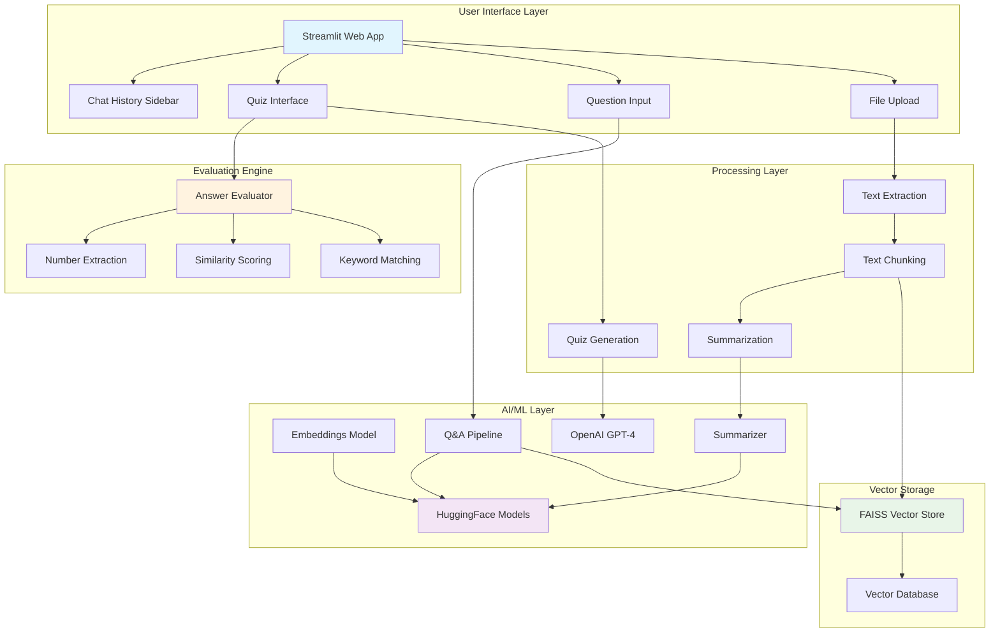

# 📄 Document Chat & Challenge

A powerful Streamlit application that enables users to upload documents (PDF/TXT), chat with them using AI, and test their understanding through automatically generated quizzes.

## ✨ Features

- **Document Processing**: Upload and process PDF or TXT documents
- **Smart Q&A**: Ask questions about your document content with confidence scoring
- **Multi-part Question Handling**: Automatically breaks down complex questions
- **Interactive Quiz Generation**: AI-generated quizzes to test comprehension
- **Chat History**: Persistent conversation history with timestamps
- **Document Summarization**: Automatic summary generation
- **Advanced Answer Evaluation**: Multi-criteria scoring system for quiz answers

## 🏗️ Architecture



## 🚀 Quick Start

### Prerequisites

```bash
pip install streamlit
pip install PyPDF2
pip install langchain
pip install transformers
pip install openai
pip install faiss-cpu
pip install sentence-transformers
```

### Installation

1. Clone or download the application
2. Install dependencies:
   ```bash
   pip install -r requirements.txt
   ```

3. **⚠️ Important**: Replace the hard-coded OpenAI API key in `app.py`:
   ```python
   os.environ["OPENAI_API_KEY"] = "your-actual-api-key-here"
   ```

4. Run the application:
   ```bash
   streamlit run app.py
   ```

### Usage

1. **Upload Document**: Select a PDF or TXT file and click "Process Document"
2. **View Summary**: Review the auto-generated document summary
3. **Choose Mode**:
   - **Ask Anything**: Interactive Q&A with the document
   - **Challenge Me**: Take an AI-generated quiz

## 📋 Requirements

Create a `requirements.txt` file with:

```
streamlit>=1.28.0
PyPDF2>=3.0.1
langchain>=0.0.350
transformers>=4.35.0
openai>=1.3.0
faiss-cpu>=1.7.4
sentence-transformers>=2.2.2
torch>=2.0.0
```

## 🧠 Technical Details

### Models Used

- **Embeddings**: `sentence-transformers/all-MiniLM-L6-v2`
- **Question Answering**: `deepset/roberta-base-squad2`
- **Summarization**: `facebook/bart-large-cnn`
- **Quiz Generation**: OpenAI GPT-4o-mini

### Architecture Components

#### 1. Document Processing Pipeline
- **Text Extraction**: Handles PDF (PyPDF2) and TXT files
- **Chunking Strategy**: Paragraph-based with sentence-level fallback
- **Vector Storage**: FAISS for similarity search

#### 2. Question Answering System
- **Multi-Document Search**: Top-5 similarity matching
- **Confidence Scoring**: Built-in model confidence metrics
- **Multi-Part Detection**: Automatic question decomposition

#### 3. Quiz Generation
- **AI-Powered**: Uses OpenAI GPT-4o-mini for question generation
- **JSON Structure**: Standardized Q&A pair format
- **Content-Aware**: Based on document chunks

#### 4. Answer Evaluation Engine
Multi-criteria scoring system:
- **Keyword Matching** (40%): Content-based similarity
- **Number Extraction** (30%): Quantitative data matching
- **Phrase Matching** (20%): N-gram similarity
- **Text Similarity** (10%): Overall text resemblance

### Session State Management

The application maintains state across interactions:
- `vector_store`: FAISS vector database
- `chat_history`: Conversation log with timestamps
- `doc_text`: Raw document content
- `summary`: Generated document summary
- `quiz`: Current quiz questions and answers

## 🔧 Configuration

### Customizable Parameters

```python
NUM_Q = 3           # Number of quiz questions
CHUNK_SIZE = 500    # Text chunk size for processing
MAX_SUMMARY = 4000  # Maximum characters for summarization
```

### Environment Variables

```bash
OPENAI_API_KEY=your-openai-api-key
```

## 🎯 Use Cases

- **Educational**: Students can upload study materials and test comprehension
- **Research**: Quickly extract information from academic papers
- **Business**: Analyze documents and generate training materials
- **Personal**: Interactive reading and learning from any text document

## 🚧 Future Enhancements

- [ ] Multi-language support
- [ ] Advanced document formats (DOCX, HTML)
- [ ] Custom model fine-tuning

## 📝 License

This project is licensed under the MIT License - see the LICENSE file for details.


**⚠️ Important Security Note**: Before deploying to production, ensure you properly secure your OpenAI API key using environment variables or a secure key management system.
